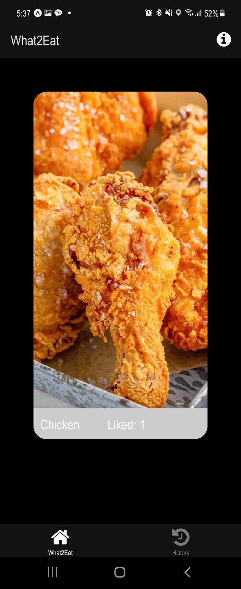
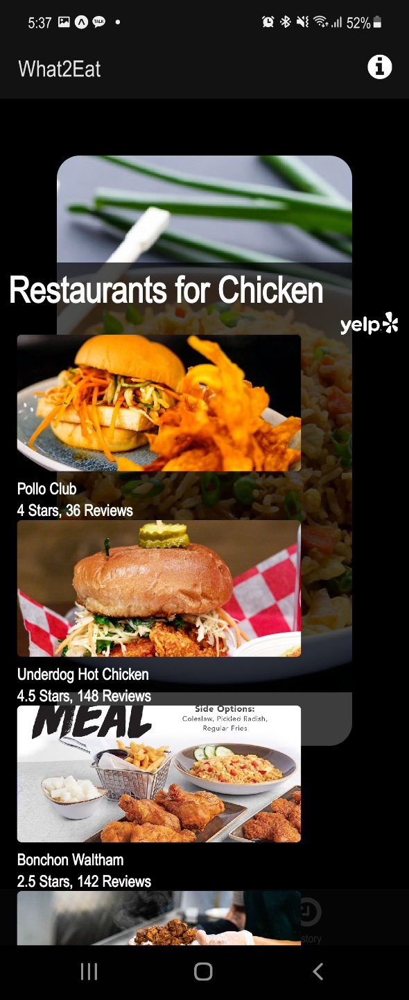
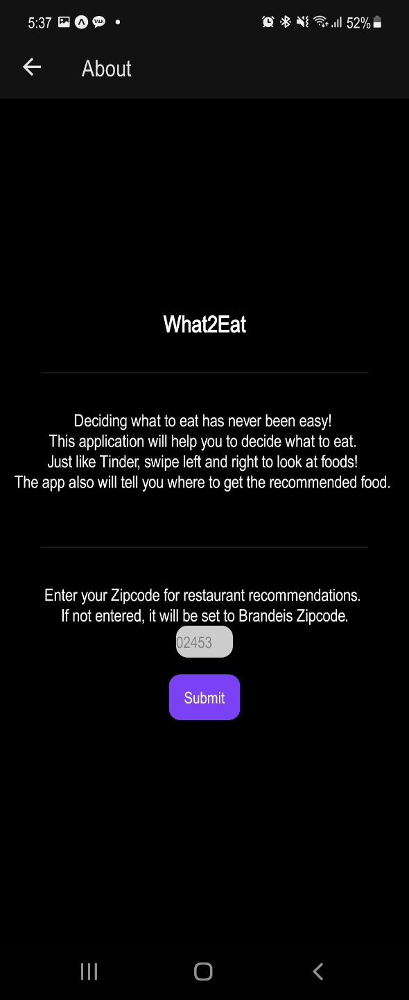
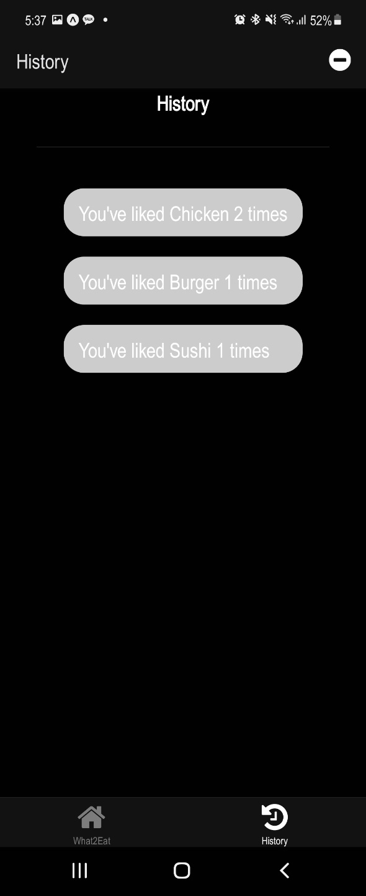

# What2Eat

**Seho Kim**

**COSI 153A Fall 2021**

## The Elevator Pitch
Deciding what to eat has never been easy!\
This application will help you to decide what to eat.\
Just like Tinder, swipe left and right to look at foods!\
The app also will tell you where to get the recommended food.

## Screenshots
Below images are took on dark mode\

## Demo Video
https://drive.google.com/file/d/1ANUKF6_GAE5872Fn8-dVbW2-k7URPYK0/view?usp=sharing

## To Install

1. clone the repo

2. switch to the project's root directory in terminal

3. create `.env` file and add Yelp API key to the file

3. install the dependencies by running `npm install` 

4. after the dependencies are installed, run `expo start` to start

## How to
Swipe left to skip, Swipe right to like.\
Then it will search the restaurants near you that sells the menu.

## Developer Notes
Used React Native, JavaScript dependencies and libraries.\
Used AsyncStorage to locally save user history for food and zip code to look restaurants near\
Used Yelp API to search restaurants which sells the user-selected menu \
A full dependency list can be found in package.json
